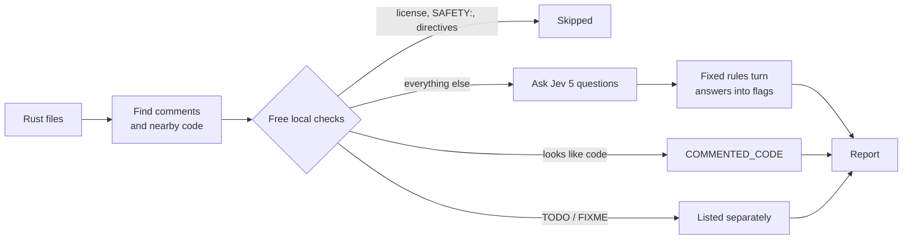

# comment-lint

**Find the comments in your Rust code that repeat, mislead, or have gone out of date.**

AI coding agents write a lot of comments. Many of them say what the next line already says (`// create a new HashMap`), or describe the edit instead of the code (`// now uses the new parser`). Worse, some stop being true after the next change. comment-lint finds them for you, so you can cut or fix them.


```
$ uv run comment_lint.py examples/demo.rs

examples/demo.rs:17   HISTORY          0.91
examples/demo.rs:28   COMMENTED_CODE   -

examples/demo.rs:33   TODO   TODO: cache this if inventories get large
--
2 flagged / 6 checked · 1 TODOs · cost $0.0001
```

- **It only reports.** It never changes your code.
- **It's cheap.** About 4 cents per 1,000 comments.
- **It's quiet by design.** It only flags a comment when it's fairly sure, and it leaves comments that explain *why* alone.
- **It's one file.** Nothing to install beyond [uv](https://docs.astral.sh/uv/).

> [!NOTE]
> This is an early version. The thresholds that decide what gets flagged are starting guesses, not yet tuned on real labeled comments. For now they're too strict for some flags: in the example above, `// Create a new empty HashMap` scores 0.66 for "only repeats the code", below the 0.90 needed for `REDUNDANT`. The demo's `STALE` example isn't caught yet either, because the tool sends only the next statement, not the whole function the comment describes. Treat the output as suggestions, and [help tune the thresholds](#tuning-the-thresholds).

## Contents

- [What it finds](#what-it-finds)
- [Quick start](#quick-start)
- [Reading the results](#reading-the-results)
- [Everyday use](#everyday-use)
- [How it works](#how-it-works)
- [Privacy and cost](#privacy-and-cost)
- [Troubleshooting](#troubleshooting)
- [FAQ](#faq)
- [Tuning the thresholds](#tuning-the-thresholds)
- [Contributing](#contributing)

## What it finds

| Flag | What it means | Example |
|---|---|---|
| `REDUNDANT` | Says only what the code already shows | `// Create a new empty HashMap` above `HashMap::new()` |
| `HISTORY` | Describes a past change instead of the code as it is | `// Now uses entry() instead of the old get/insert pair` |
| `STALE` | Says something the code contradicts | `// Returns true if the item was fully removed` above code that returns `true` even when some is left |
| `FRAGILE` | Spells out details that the next edit will make wrong | `// Loops 3 times, then calls parse_v2()` |
| `COMMENTED_CODE` | Old code left behind in a comment | `// let removed = self.items.remove(name);` |

Comments that explain a reason, a rule, or a tradeoff are kept, such as `// Saturate instead of erroring: callers treat over-removal as "take what's left".`

`TODO` and `FIXME` comments are listed separately, without judgment.

Apart from the `FRAGILE` one, these examples come from [`examples/demo.rs`](examples/demo.rs).

## Quick start

### 1. Install uv

uv runs Python scripts and installs whatever they need on its own. You don't need to set up Python yourself.

**macOS / Linux**
```sh
curl -LsSf https://astral.sh/uv/install.sh | sh
```

**Windows (PowerShell)**
```powershell
powershell -ExecutionPolicy ByPass -c "irm https://astral.sh/uv/install.ps1 | iex"
```

Then open a new terminal and check that it worked:

```sh
uv --version
```

### 2. Get comment-lint

```sh
git clone https://github.com/santiagolgzz/comment-linter
cd comment-linter
```

### 3. Try it without an API key

A dry run finds comments and runs the free local checks. It doesn't contact any service.

```sh
uv run comment_lint.py --dry-run examples/demo.rs
```

```
examples/demo.rs:28   COMMENTED_CODE   -

examples/demo.rs:33   TODO   TODO: cache this if inventories get large
--
1 flagged / 1 checked · 1 TODOs · cost $0.0000
5 comments would be sent to Jev
```

The first run takes a few seconds while uv downloads what it needs. After that it starts right away.

### 4. Get an OpenRouter API key

The judgment calls ("is this comment redundant?", "is it out of date?") are made by Jev, a small, cheap model you reach through [OpenRouter](https://openrouter.ai).

1. Create an OpenRouter account.
2. Add credits on the [Credits page](https://openrouter.ai/settings/credits). One dollar covers tens of thousands of comments (see [cost](#privacy-and-cost)).
3. Create a key on the [Keys page](https://openrouter.ai/keys). Give it a credit limit, such as $1, so a leaked key can't spend more than that.

### 5. Give the key to comment-lint

comment-lint reads the key from an environment variable called `OPENROUTER_API_KEY`. There's no config file.

**macOS / Linux**
```sh
export OPENROUTER_API_KEY="sk-or-..."
```

**Windows (PowerShell)**
```powershell
$env:OPENROUTER_API_KEY = "sk-or-..."
```

This lasts until you close the terminal. To keep it:

- **macOS / Linux:** add the `export` line to your shell profile (`~/.zshrc` or `~/.bashrc`).
- **Windows:** run `setx OPENROUTER_API_KEY "sk-or-..."` once, then open a new terminal.

> [!CAUTION]
> Never put your key in a file inside a repository. Anyone who can read the repository could spend your credits.

### 6. Check the connection

```sh
uv run comment_lint.py --probe
```

This sends one example request and shows exactly what came back. You should see `HTTP 200`, five scores between 0 and 1, and a cost. If you get an error instead, look it up in [Troubleshooting](#troubleshooting).

### 7. Run it on your code

```sh
uv run comment_lint.py path/to/your/project
```

Pass a folder to check every `.rs` file inside it (`target/` and hidden folders are skipped), or pass single files.

## Reading the results

```
examples/demo.rs:17   HISTORY          0.91
```

- **`examples/demo.rs:17`** is where the comment is. A range such as `:81-82` means the comment spans several lines.
- **`HISTORY`** is what's wrong with it (see [What it finds](#what-it-finds)).
- **`0.91`** is how sure the model is, from 0 to 1. Local checks such as `COMMENTED_CODE` show `-`, because no model was involved.

The last line sums up the run:

```
2 flagged / 6 checked · 1 TODOs · cost $0.0001
```

2 comments were flagged out of 6 checked. There's 1 TODO, and the run cost $0.0001. A cost that starts with `~` is an estimate.

### What to do with a flag

| Flag | Usually |
|---|---|
| `REDUNDANT` | Delete the comment. |
| `HISTORY` | Delete it, or rewrite it to describe the code as it is now. The story of the change belongs in the commit message. |
| `STALE` | Look closely: either the comment is wrong, or the code is. |
| `FRAGILE` | Rewrite it to say *why*, not *how*. |
| `COMMENTED_CODE` | Delete it. Git keeps the old version. |

You're always the judge. If a flag is wrong, leave the comment alone.

### Exit codes

| Code | Meaning |
|---|---|
| `0` | Nothing flagged. |
| `1` | At least one comment was flagged. |
| `2` | Something went wrong: no key, a rejected key, or some comments couldn't be checked (and nothing was flagged). |

## Everyday use

### See every comment, not just flagged ones

```sh
uv run comment_lint.py --all src/
```

Each checked comment gets a line with all five scores, so you can see why it was or wasn't flagged.

### Get the results as JSON

```sh
uv run comment_lint.py --json src/ > flagged.json
```

For each flagged comment you get its text, the code around it, all five scores and its flags. That's handy to give an AI assistant along with a request like "suggest fixes for these comments". Add `--all` to include every comment.

### Run it without cloning

uv can run the script straight from GitHub:

```sh
uv run https://raw.githubusercontent.com/santiagolgzz/comment-linter/main/comment_lint.py src/
```

### Run it in GitHub Actions

Add your key as a repository secret named `OPENROUTER_API_KEY`, then add this workflow:

```yaml
# .github/workflows/comment-lint.yml
name: comment-lint
on: pull_request

jobs:
  comments:
    runs-on: ubuntu-latest
    steps:
      - uses: actions/checkout@v7
      - uses: astral-sh/setup-uv@v7
      - run: uv run https://raw.githubusercontent.com/santiagolgzz/comment-linter/main/comment_lint.py src/
        env:
          OPENROUTER_API_KEY: ${{ secrets.OPENROUTER_API_KEY }}
        continue-on-error: true  # report only; remove once you trust the results
```

Because the tool exits with `1` when it flags something, removing `continue-on-error` makes flagged comments fail the check.

### Re-runs are nearly free

comment-lint saves every answer in `.comment-lint-cache.json`, in the folder you run it from. On the next run it only asks about comments that are new, or whose text or nearby code changed.

- `--no-cache` asks about everything again.
- `--cache PATH` keeps the file somewhere else.

### All options

| Option | What it does |
|---|---|
| `--dry-run` | Find comments and run the local checks only. No key needed, nothing sent. |
| `--probe` | Send one example request and print the raw response, to test your setup. |
| `--all` | Show every checked comment with its scores, not just flagged ones. |
| `--json` | Print the results as JSON. |
| `--csv PATH` | Save every checked comment and its scores to a CSV file, with an empty `label` column for tuning. |
| `--evaluate PATH` | Test the current thresholds against a labeled CSV. No API calls. |
| `--cache PATH` | Where to keep the answer cache (default: `.comment-lint-cache.json`). |
| `--no-cache` | Don't read or write the cache. |

## How it works



1. **Find comments.** [tree-sitter](https://tree-sitter.github.io/) reads each file and finds every `//` and `/* */` comment. Comment lines in a row count as one comment. Doc comments (`///`, `//!`) are left out on purpose (see the [FAQ](#faq)).

2. **Run the free local checks.** Some comments don't need a model:
   - `TODO` and `FIXME` are listed separately.
   - License headers, `// SAFETY:` notes and tool directives (`rustfmt::`, `clippy::`, `@generated`, …) are skipped and never flagged.
   - Commented-out code is flagged as `COMMENTED_CODE`. A comment only counts as code if it's valid Rust *and* shows clear signs of code, such as `;`, `=`, `::`, a function call or a `let`. Valid Rust alone isn't enough: short phrases like `// safety` or `// return result` are valid Rust too.

3. **Ask Jev.** Each remaining comment goes to Jev with the function it sits in, the line before it and the code it describes. Jev answers five yes/no questions, each as a score from 0 to 1:

   | Question | In plain words |
   |---|---|
   | `restates` | Does it only repeat what the code shows? |
   | `rationale` | Does it explain a reason, a rule, or a tradeoff? |
   | `inconsistent` | Does the code contradict it? |
   | `history` | Does it describe a past change? |
   | `fragile` | Will the next routine edit make it wrong? |

4. **Apply fixed rules.** Plain code, not the model, decides what to flag:

   | Flag | Rule |
   |---|---|
   | `STALE` | `inconsistent` above 0.75 |
   | `HISTORY` | `history` above 0.80 |
   | `REDUNDANT` | `restates` above 0.90 and `rationale` below 0.20 |
   | `FRAGILE` | `fragile` above 0.85 and `rationale` below 0.30 |

   A comment that clearly explains a reason (`rationale` above 0.70) is never flagged, except as `STALE`: a wrong reason is still wrong.

The full design, and the reasoning behind each choice, is in [SPEC.md](SPEC.md).

## Privacy and cost

**What leaves your machine.** For each comment sent to Jev: the comment, its file path, the signature of the function it's in, the line before it and the code it describes, capped at about 1,000 tokens. Nothing else is sent. Comments handled by the local checks never leave your machine.

**Where it goes.** To OpenRouter, which passes it on to TypeSafe, the company that runs Jev. Every request tells OpenRouter to use only providers that neither store your data nor train on it. If no such provider is available, the request fails rather than going anywhere else.

**What it costs.** Jev charges about $0.042 per million input tokens, and a typical comment with its context and the five questions comes to about 850 tokens. In a test on 245 comments from ripgrep, that worked out to about 4 cents per 1,000 comments, and took 23 seconds. Each run shows its total on the last line.

## Troubleshooting

| You see | What it means | What to do |
|---|---|---|
| `uv: command not found` | uv isn't installed, or this terminal doesn't know about it yet. | Install uv ([step 1](#1-install-uv)), then open a new terminal. |
| `OPENROUTER_API_KEY is not set` | This terminal doesn't have the key. | Set it ([step 5](#5-give-the-key-to-comment-lint)) in the terminal you run the tool from. |
| `HTTP 401` … `the API key was rejected` | The key is mistyped, deleted, or expired. | Copy it again from the [Keys page](https://openrouter.ai/keys). |
| `HTTP 402` … `out of credits` | No credits left, or the key reached its credit limit. | Add credits, or raise the key's limit. |
| `HTTP 404` … `privacy settings` | No provider for Jev currently meets the no-storage, no-training rule, or the model has been renamed. | Run `--probe` and read OpenRouter's message. If it's the privacy rule, try again later. |
| `ERROR   gave up after 3 tries (HTTP 429)` | Too many requests, or the service is busy. | Wait a minute and run again. Comments that already got answers won't be re-sent. |
| `ERROR   bad response: …` | Jev replied in a shape the tool doesn't expect. | Run `--probe` and compare the raw reply with what was decoded. Please [open an issue](https://github.com/santiagolgzz/comment-linter/issues) with the output, minus anything private. |
| A flag you disagree with | The thresholds aren't tuned yet. | Ignore it, or help [tune the thresholds](#tuning-the-thresholds). |

## FAQ

**Does it change my code?**
No. It reads your files and prints a report. That's all.

**Which languages does it support?**
Rust only, for now. The approach isn't Rust-specific, so more languages could come later.

**Why not ask a big model like Claude or GPT to review every comment?**
Cost and noise. Jev is built to answer yes/no questions with a score, at a tiny fraction of the price of a large model, so checking every comment stays cheap. Plain rules then decide what's worth flagging. A large model is better used afterwards, on the few comments that get flagged (see [JSON output](#get-the-results-as-json)).

**Why are doc comments (`///`) skipped?**
They're written for people reading generated docs or an editor's hover popup, who can't see the function body. Restating what a function does is often exactly right there. They'll need their own rules.

**Why is `// SAFETY:` never flagged?**
In Rust, a `// SAFETY:` comment explains why an `unsafe` block is sound. It should always stay.

**Can I change what gets flagged?**
Yes. The thresholds are in `THRESHOLDS` near the top of `comment_lint.py`. Use `--evaluate` to check that a change actually helps (see below).

## Tuning the thresholds

The thresholds are starting guesses. Here's how to replace them with numbers based on real comments:

1. **Collect scores.** Run on one or more projects, aiming for about 200 comments in total:
   ```sh
   uv run comment_lint.py --csv dump.csv path/to/project another/project
   ```
2. **Label them.** Open `dump.csv` in a spreadsheet. In the `label` column, write `keep`, `cut`, or `rewrite` for each comment.
3. **Test the thresholds.** Edit `THRESHOLDS` in `comment_lint.py`, then run:
   ```sh
   uv run comment_lint.py --evaluate dump.csv
   ```
   It shows how many `cut` and `rewrite` comments get caught, and which `keep` comments get flagged by mistake. Aim for very few mistakes: a noisy linter gets ignored.
4. **Keep the labels.** Commit the labeled file, so future changes can be checked against it.

## Contributing

Contributions are welcome, especially labeled comments for tuning and reports from real runs.

Run the tests. They use a fake Jev, so no key or credits are needed:

```sh
uv run --with pytest==8.4.2 --with-requirements comment_lint.py pytest -q tests
```

Check the code style:

```sh
uvx ruff check --line-length 120 comment_lint.py tests/
```

Before changing how comments are judged, please read [SPEC.md](SPEC.md). It explains why things work the way they do.

## License

[MIT](LICENSE)
